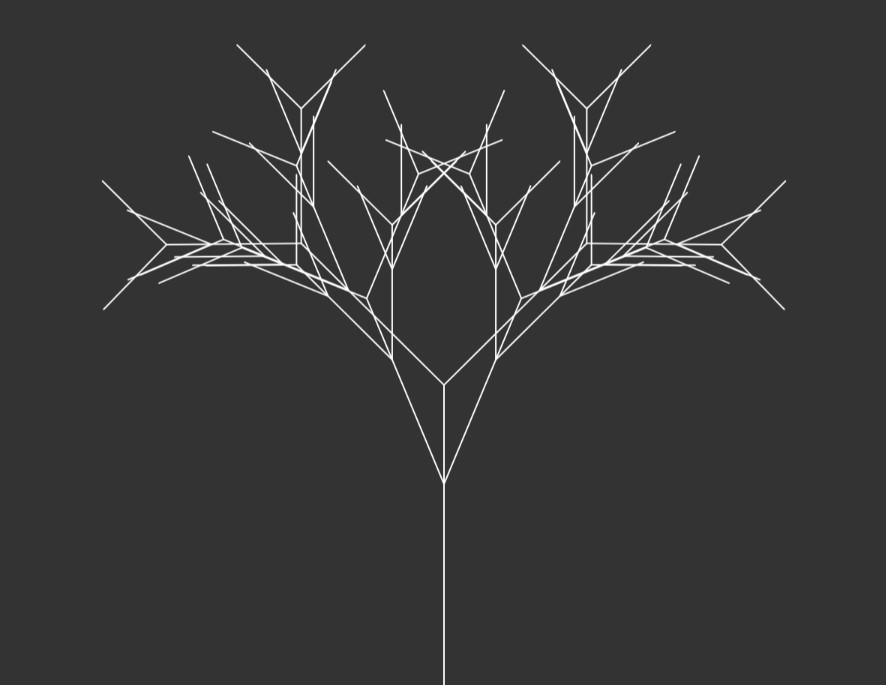
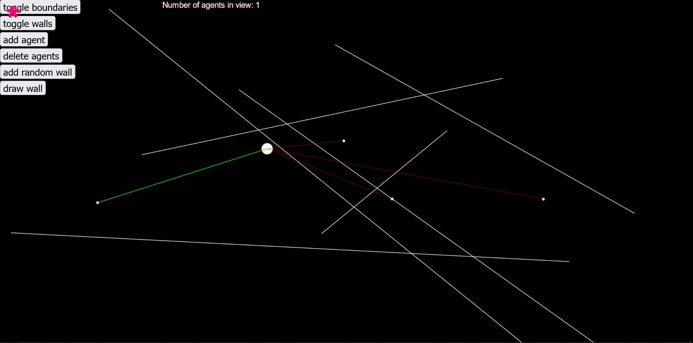
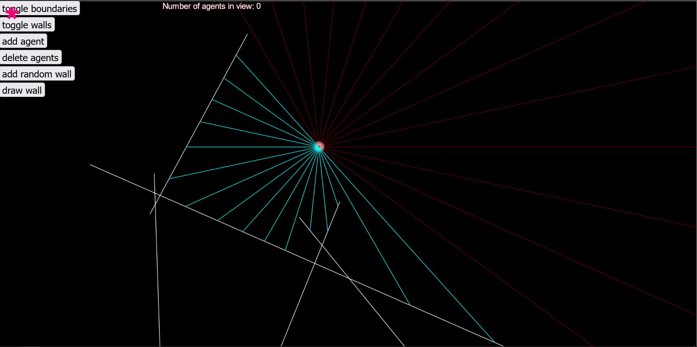

# P5.JS Projects
P5.JS projects I'm working on to learn JS and rendering applications

Many projects inspired by coding train videos

## Installation

I use [p5-manager](https://www.npmjs.com/package/p5-manager) to run the apps.

You can download it from npm either as a global or local dependency.

```
//local
npm install p5-manager

//global
npm install -g p5-manager 
```

## Project list

### Recursive tree branching



### Raycasting and Perlin Noise



